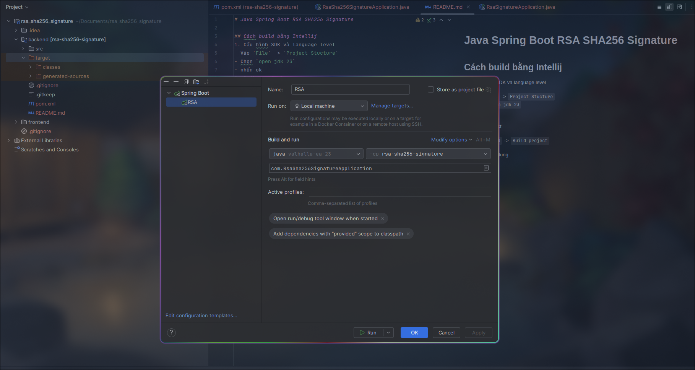

# Java Spring Boot RSA SHA256 Signature

## Cách build bằng Intellij
1. Cấu hình SDK và language level
- Vào `File` -> `Project Stucture`
- Chọn `open jdk 23`
- nhấn ok
2. Build project
- Vào `Build` -> `Build project`
3. Chạy ứng dụng
- 
- Nhấn nút tam giác màu xanh